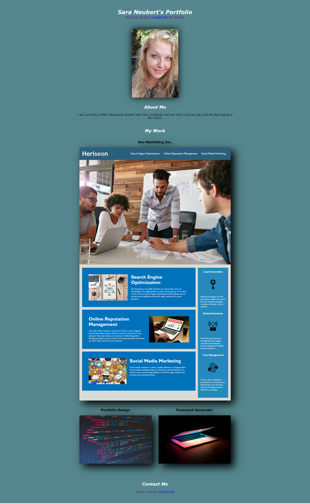

# Sara Neubert's Portfolio

## Description

This is a basic portfolio website that I have created for myself, including work that I have already completed and space for projects in the works. Content code has been organized, consolidated, and updated to meet accessibility standards.

## Screenshot

## Link 

![Live URL] (https://phoenixpyra7.github.io/Sara-Neubert-s-Portfolio/)

Sources:
Place holder photos from unsplash.com
joshua-reddekopp-SyYmXSDnJ54-unsplash - photo of labtop closing
florian-olivo-4hbJ-eymZ1o-unsplash -photo of code background
